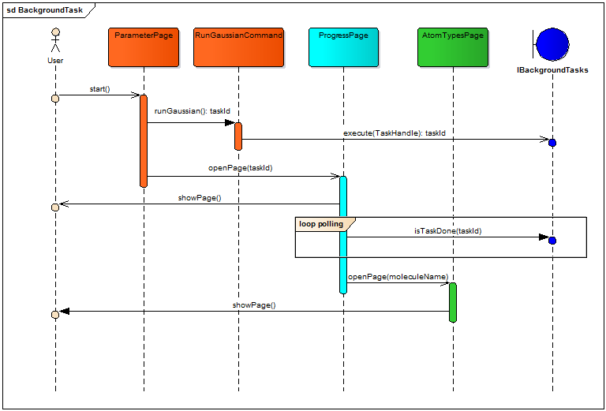

# Fitting Web #

## Important Classes ##

The following classes and interfaces implement key concepts:
- `HeaderPage` should be the base class for all pages with standard layout. This base class renderes the `HeaderPage.html` template for all derived page classes. The template defines the navigation bar, content container and footer of the website.
- `WizardPage` should be the base class for all pages in the web application. The `HeaderPage` also implements this base class. This class ensures that there is a username associated with the current session and opens the `ProgressPage` if a user has a long running task. 
- `IAmACommand` is a marker interface and may be used to mark classes which implement the command concept. A command should be used to encapsulate and spawn a long running task. Details of the command concept are described bellow. 
- `MockScriptBase` may be used as base class for `Mock` script implementations. It helps to group all Mock script implementations and provides useful methods for mock implementations. 

## Background Task Execution ## 

The following sequence diagram shows the execution of a long running task.

1. The users clicks the start button on the `ParameterPage` to import a molecule.
2. The `ParameterPage` provides the `RunGaussianCommand` with all necessary parameters to start execution of the long runnging task.
3. The `RunGaussianCommand` defines the details of the long running task and starts execution via the `IBackgroundTasks` service.
4. The `RunGaussianCommand` returns the task ID to the `ParameterPage`.
5. The `ParameterPage` redirects the user to the `ProgressPage` with the given task ID.
6. The `ProgressPage` starts polling for the status of the task with the given ID.
7. Once the task is done, the `ProgressPage` will open the `AtomTypesPage` with the molecule name as parameter.
8. The user sees the result of the long running task on the website. 

Command classes should obey the following rules:
- Commands are the glue between background work and 
- Commands must not have a constructor with paramters due to dependency management in Wicket 
- Commands must retrieve their service dependencies via a field with @Inject attribute 
- Commands must be stateless. No fields, execpt for service dependencies, should be defined in the class
- Commands with a long list of parameters, should use a parameter object
- Commands must return the started task ID to the caller